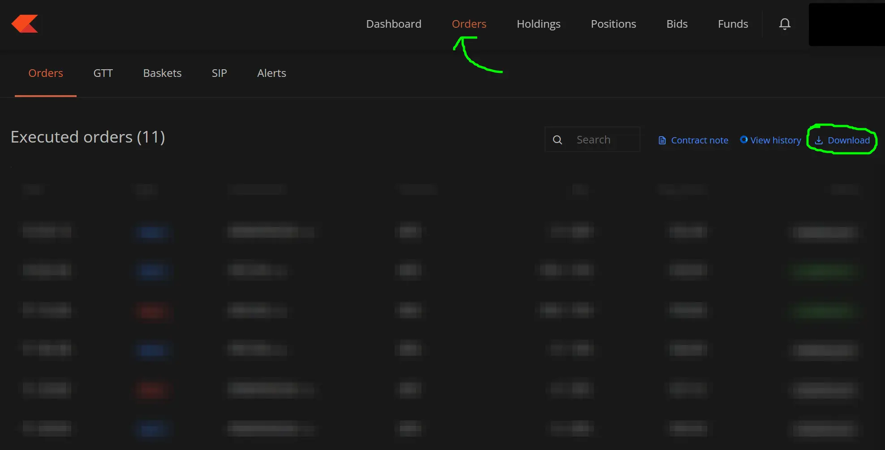

# Zerodha Intraday P&L

A script to get some info on final P&L on your intraday trades on Zerodha after considering all charges like brokerage, STT and exchange transaction charges.

Brokerage value taken from Zerodha's own calculator, which lets you only calculate for one trade - https://zerodha.com/static/js/brokerage.js.

## Steps to Run

1. Just click on download on the order's page on Zerodha and save it in your `Downloads` folder.
   
2. An `orders.csv` file will be exported. This script looks for such a file in your `Downloads` folder or in the folder the script is being run from.
